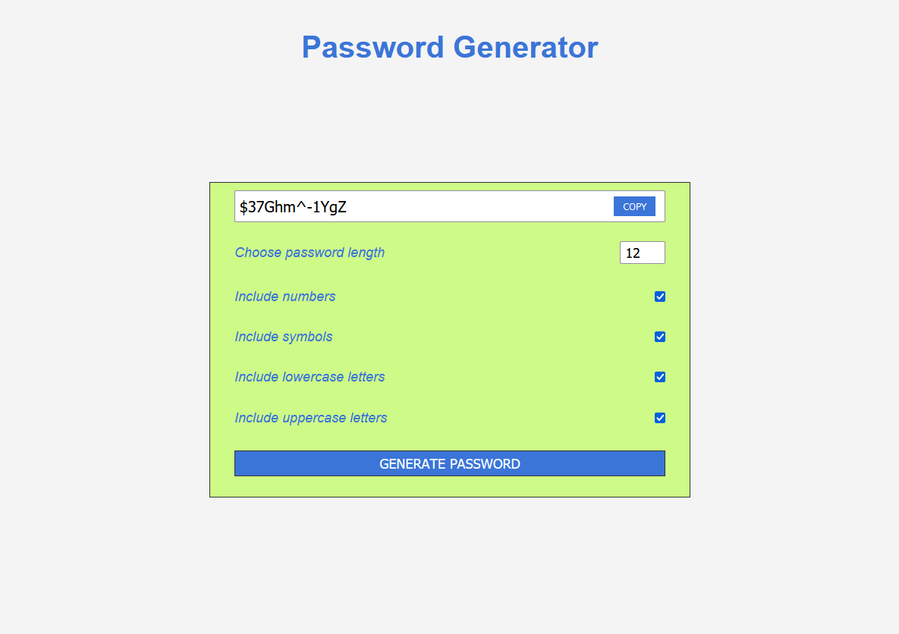

# Password-generator
HTML CSS JS
 

 
Generate random password of desired length, with option to include/exclude numbers, symbols, uppercase letters, lowercase letters,
and 'Copy' button functionality.

Default password length is 8 characters long.

The idea for project came from <a href="https://www.youtube.com/watch?v=duNmhKgtcsI">here.</a>

Functionality and UI options are the same, but the code is completely mine, I managed to implemet it without 'peeking' into Brad's solution.

